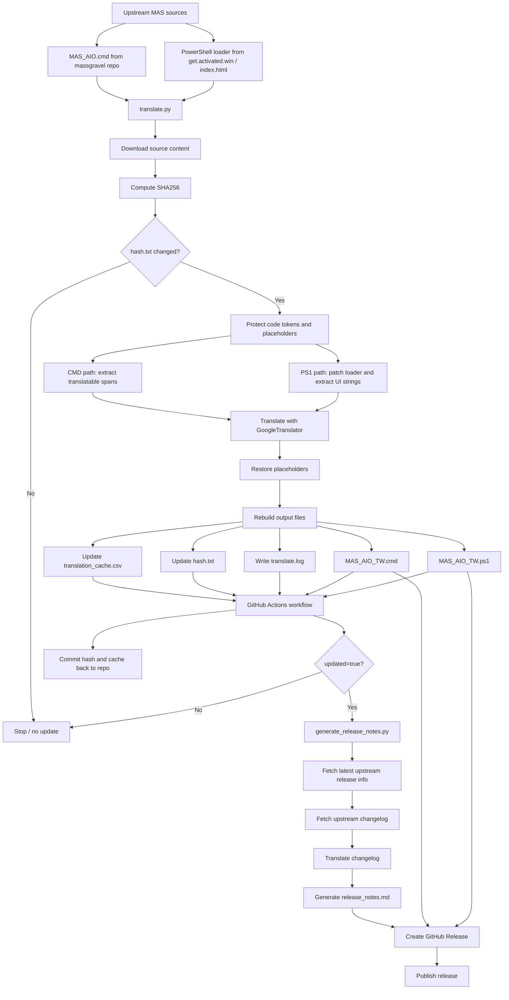

# MAS 繁體中文自動翻譯版

> **本專案由自動化腳本生成翻譯，不保證 100% 準確。**  
> 若執行遇到問題，請使用官方原版：`irm https://get.activated.win | iex`

---

## 📖 關於本專案

這是一個將 **MAS (Microsoft Activation Scripts)** 自動翻譯為繁體中文的專案。

MAS 是一個開源的 Windows 與 Office 啟用工具，包含 HWID、Ohook、TSforge 與 Online KMS 等模式，並附帶診斷與故障排除能力。

由於官方腳本更新頻繁且內容龐大，手動翻譯難以維護。本專案透過 Python 腳本，自動抓取上游來源、抽取可翻譯的 UI 文字、保護批次檔與 PowerShell 語法，再重建成可執行的繁體中文版本。

---

## 🚀 一鍵執行

請以系統管理員開啟 PowerShell 執行：

```powershell
irm https://raw.githubusercontent.com/sos19941015/Microsoft-Activation-Scripts-MAS--TW/main/MAS_AIO_TW.ps1 | iex
```

---

## 📦 手動下載

前往 [Releases 頁面](https://github.com/sos19941015/Microsoft-Activation-Scripts-MAS--TW/releases) 下載最新版：

| 檔案 | 說明 |
|------|------|
| `MAS_AIO_TW.cmd` | 批次檔版本，以系統管理員身分雙擊執行 |
| `MAS_AIO_TW.ps1` | PowerShell 載入器，適合搭配 `irm` 指令使用 |

---

## 🔄 專案流程



---

## ✨ 專案特色

| 特性 | 說明 |
|------|------|
| 自動更新 | GitHub Actions 每日檢查上游變更並自動重建 |
| 翻譯快取 | 使用 `translation_cache.csv` 減少重複翻譯 |
| 語法保護 | 保護 `%var%`、`!var!`、PowerShell 字串與控制流程，避免翻壞腳本 |
| 雙格式支援 | 同時生成 `.cmd` 與 `.ps1` 版本 |
| 自動發版 | 偵測到更新後自動產生 Release Notes 並發佈 Release |

---

## 🛠️ 本地執行

```bash
pip install -r requirements.txt
python translate.py
```

---

## 🧠 翻譯安全準則

這次專案也整理出一份「翻譯但不破壞原語法與執行邏輯」的 skill，放在：

- [skills/syntax-safe-translation/SKILL.md](skills/syntax-safe-translation/SKILL.md)
- [skills/syntax-safe-translation/agents/openai.yaml](skills/syntax-safe-translation/agents/openai.yaml)

這份文件總結了：

- 哪些字串屬於 UI，可翻譯
- 哪些字串屬於邏輯，不可翻譯
- 如何保護 `%var%`、`!var!`、`$var`、URL、雜湊值與命令列片段
- 為什麼同一行多段字串替換要從右往左進行
- 為什麼翻譯後一定要做 parser 或語法驗證

---

## 🙏 致謝

特別感謝 **[massgravel](https://github.com/massgravel)** 開發並維護 [Microsoft-Activation-Scripts](https://github.com/massgravel/Microsoft-Activation-Scripts)。

---

## ⚠️ 免責聲明

- 翻譯內容由自動化腳本生成，不保證語意完全正確。
- 本專案僅用於研究自動化翻譯流程。
- 若執行過程出現錯誤或異常行為，請務必使用官方原版：
  - `irm https://get.activated.win | iex`
  - [massgravel/Microsoft-Activation-Scripts](https://github.com/massgravel/Microsoft-Activation-Scripts)
